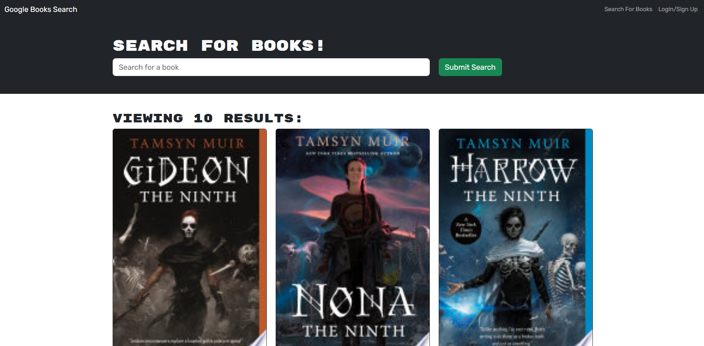

# Week 21 - MERN Final Challenge

  This project was done by refactoring and existing book search engine into one that uses Apollo/GraphQL.  
  

  ## Description

  A user can search for books, and save them to their profile page so they can keep track of their next reads! 

  Screenshot or GIF of final output:  
  

  ## Table of Contents
  * [Dependencies](#dependencies)
  * [Installation](#installation)
  * [Executing Program](#execution)
  * [Authors](#authors)
  * [Questions](#questions)
  * [License](#license)
  * [Acknowledgements](#acknowledgements)
  * [Tests](#tests)

  Link to the repository (if needed):  
  https://github.com/dionkb/improved-robot.git

  ## Getting Started

  ### Dependencies
  See package.json files within repository

  ### Installation
  N/A

  ## Usage

  ### Executing Program
  Navigate to the deployed page using the link below. Next, sign up or login to begin saving searched books.
  
  Link to the deployed application (if applicable):  
  [Deployed App](https://blooming-coast-65497-ac1236025f14.herokuapp.com/)

  ## Additional Information

  ### Authors
  Dion Baskara

  ### Questions
  For any questions, please reach out to me at dionkbaskara@gmail.com

  ### Contributing
  To help contribute to the project, reach out to me on Github.  
  There, you can report an issue if you encounter one.  
  GitHub profile: <a href="https://github.com/dionkb">Click Here</a>

  ### License  
  MIT License: For more information,  <a href="https://opensource.org/license/mit/">click here</a>  
  See also: LICENSE.md file located within directory (if applicable) 

  ### Acknowledgements
  N/A

  ### Tests
  N/A
  
